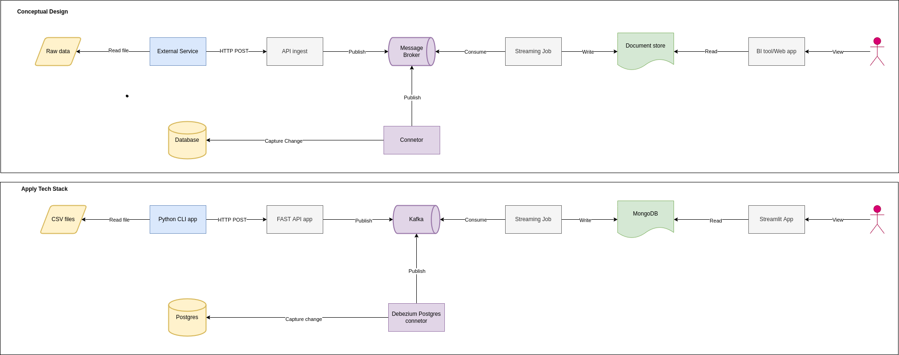

# data_streaming_pipeline_2022


## What we will do in this project
- API serve by framework FastAPI
- Apache Kafka as message broker
- MongoDB as document storage
- Streamlit as dashboard
- Spark as computing engine


## Pipeline Desgin 



## Prerequitesite

### 1. Install Python
### 2. Setup virtualenv
```
$ python3 -m venv venv;
$ source venv/bin/activate;
```
### 3. Setup docker, docker compose


## Programming technique

- Inversion control implemented by Dependency Injection


## Reference
1. [Streaming data from Postgres to Kafka by Debezium](https://arctype.com/blog/kafka-tutorial-1/)

